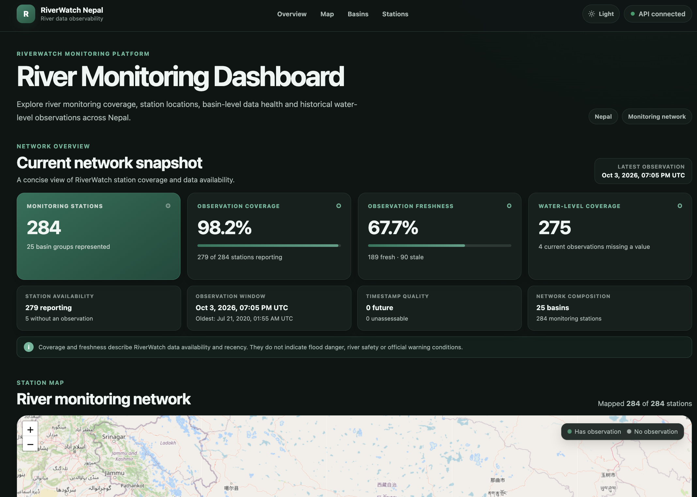
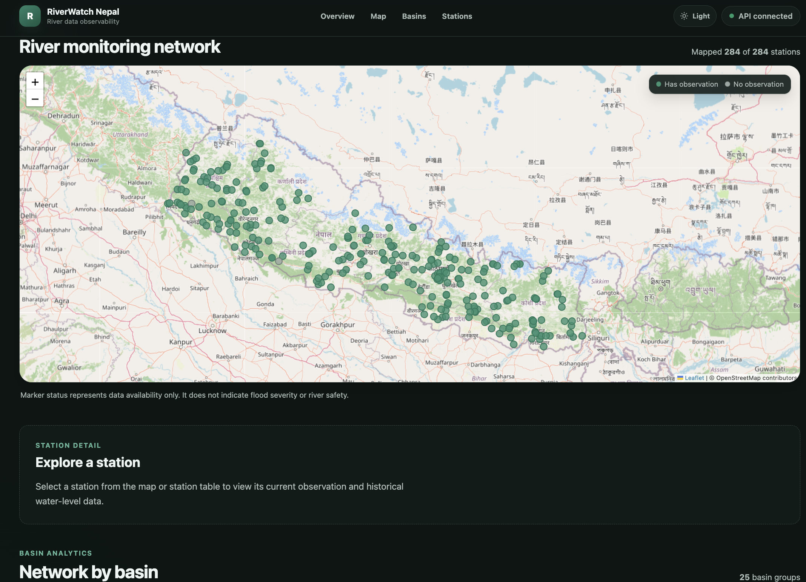
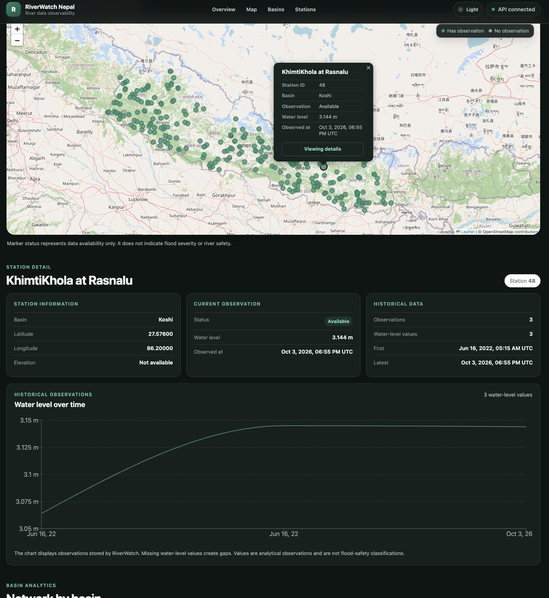
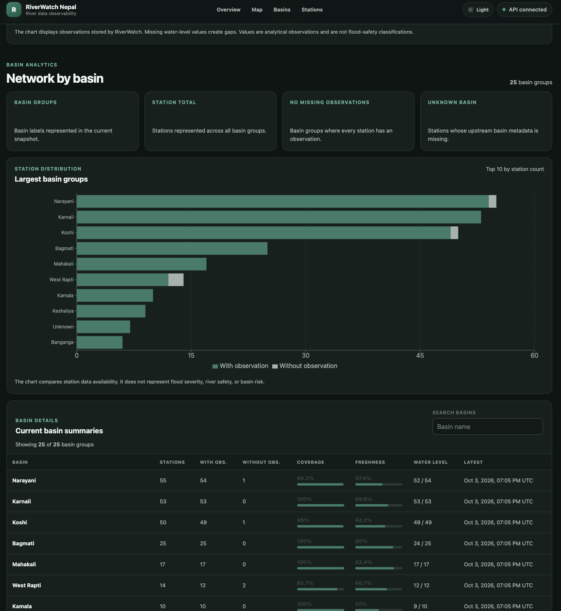
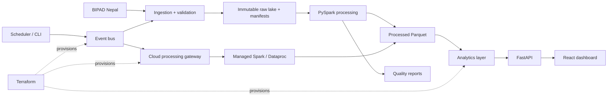

# RiverWatch Nepal

**RiverWatch Nepal** is a cloud-ready, near-real-time river monitoring and analytics platform built around Nepal's BIPAD river-station data. It ingests and validates source data, preserves immutable raw records, processes typed datasets with Apache Spark, evaluates data quality, exposes analytics through FastAPI, and presents the results in an interactive React dashboard.

> RiverWatch currently describes monitoring coverage, observations, recency, and data quality. It does **not** claim to provide official flood warnings or river-safety guidance.

<p align="center">
  
</p>

<p align="center">
  
</p>
<p align="center">
  
</p>
<p align="center">
  
</p>

## What the system does

- Ingests river-station and observation data from **BIPAD Nepal** with pagination, retries, validation, and quarantine handling.
- Preserves source records in an **immutable raw data lake** with manifests, checksums, run metadata, and deterministic paths.
- Uses **PySpark** to transform raw records into typed Parquet station and observation datasets.
- Produces **data-quality reports** for station validity, observation completeness, timestamps, and freshness.
- Builds current-network, station-history, and basin-level analytics with a local **DuckDB** implementation and a cloud **BigQuery** implementation.
- Exposes typed HTTP endpoints through **FastAPI**.
- Provides an interactive **React + TypeScript** dashboard with network KPIs, station search/filtering, a Leaflet map, station history, basin analytics, and light/dark themes.
- Includes an **event-driven execution model** with idempotency, retries, dead-letter handling, and durable processing-completion receipts.
- Defines cloud infrastructure as code with **Terraform** for GCS, Pub/Sub, Cloud Run, Dataproc, BigQuery/BigLake, Artifact Registry, IAM, and Cloud Scheduler.

## Architecture



The local and cloud implementations share the same domain concepts and API contracts. Local development uses filesystem-backed storage/event components and DuckDB; the cloud-ready path uses GCS, Pub/Sub, managed Spark/Dataproc, and BigQuery.

## Dashboard

The current dashboard shows a network snapshot, observation coverage and freshness, mapped monitoring stations, station details and historical water levels, basin-level summaries, and a searchable/filterable station table.

<p align="center">
  
</p>

A recent local snapshot contained **284 monitoring stations across 25 basin groups**, with 279 stations reporting a current observation. These values are data-dependent and change as new runs are ingested.

## Technology stack

| Layer | Technologies |
| --- | --- |
| Language / models | Python 3.12+, Pydantic, pydantic-settings |
| Source ingestion | HTTPX, Tenacity, BIPAD API |
| Storage | Local filesystem abstraction, Google Cloud Storage |
| Processing | Apache Spark / PySpark, Parquet |
| Analytics | DuckDB locally, BigQuery / BigLake for cloud analytics |
| API | FastAPI, Uvicorn |
| Events | Local event bus, Google Cloud Pub/Sub |
| Cloud runtime | Cloud Run, Dataproc, Cloud Scheduler, Artifact Registry |
| Infrastructure | Terraform |
| Frontend | React, TypeScript, Vite, Leaflet, React-Leaflet, Recharts |
| Quality | Pytest, Ruff, mypy, Vitest, ESLint |

## Repository structure

```text
riverwatch/
├── src/riverwatch/          # Python application and domain packages
│   ├── ingestion/           # BIPAD ingestion and validation
│   ├── storage/             # object-store abstractions and lake layout
│   ├── processing/          # manifest discovery and Spark pipeline
│   ├── quality/             # data-quality rules and reports
│   ├── analytics/           # DuckDB and BigQuery analytics services
│   ├── api/                 # FastAPI schemas and routes
│   ├── events/              # event contracts, workers, retry/idempotency
│   └── cloud/               # Cloud Run / Dataproc runtime adapters
├── frontend/                # React + TypeScript dashboard
├── infra/terraform/         # reusable Terraform modules and dev stack
├── containers/              # API, ingestion, gateway, relay, Spark images
├── scripts/                 # local runners, inspection and validation tools
├── tests/                   # unit and integration tests
└── docs/                    # architecture and project documentation
```

## Running locally

Create and activate a Python virtual environment, install the project, then run the backend:

```bash
python -m pip install -e ".[dev]"
python -m uvicorn riverwatch.api.app:create_app --factory --reload --app-dir src
```

Run the frontend in another terminal:

```bash
cd frontend
npm install
npm run dev
```

The repository also includes scripts for source inspection, ingestion, historical backfill, Spark processing, analytics inspection, and local event workers.

## Verification

The backend reached a full regression run of **484 passing Python tests**, with Ruff, strict mypy checks, Terraform validation/policy checks, and the processing-completion relay contract check passing. The frontend currently has **6 passing Vitest tests**, plus ESLint and a production Vite/TypeScript build gate.

Typical checks:

```bash
python -m pytest
ruff check .
mypy src
./scripts/check_terraform.sh
./scripts/check_processing_completion_relay_contract.sh

cd frontend
npm run check
npm run test:coverage
```

## Deployment status

The application and infrastructure are **deployment-ready but not currently hosted as a live GCP deployment**. Cloud service enablement and deployment are intentionally controlled through Terraform feature flags, and the project was validated locally without applying billable cloud infrastructure.

## Documentation

- [Project overview](RiverWatch_Nepal_Overview.pdf) - the full project story, architecture, and phase-by-phase development.
- [Developer guide]() - detailed internal reference for packages, files, code flow, tests, cloud runtime, Terraform, containers, and operations*(will be added soon)*.
- Existing focused documentation under `docs/` covers analytics, API behavior, data quality, event processing, Terraform operations, and cloud infrastructure.

## Future possibilities

RiverWatch can later be extended beyond the current monitoring dashboard, but those ideas are intentionally outside the scope of the present system documentation.

---

**Current documented revision:** `42a8776` - `Dashboard designed and added dark mode`
